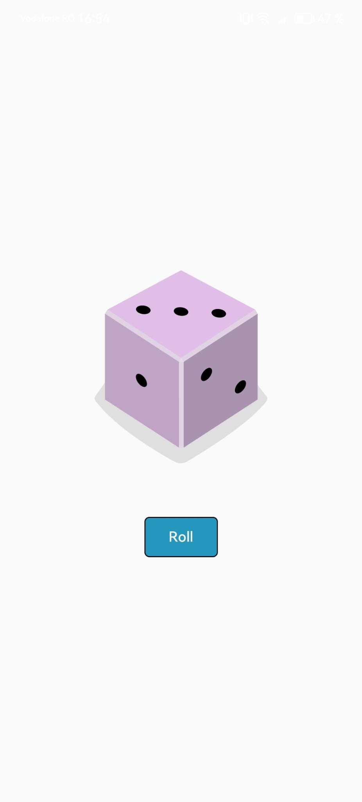

# Dice Roller #

This was the first interactive app built in the [Android Basics with Compose](https://developer.android.com/courses/android-basics-compose/course) course. It allows user to roll a dice when pressing a button. This was a good introduction to states in Compose.

